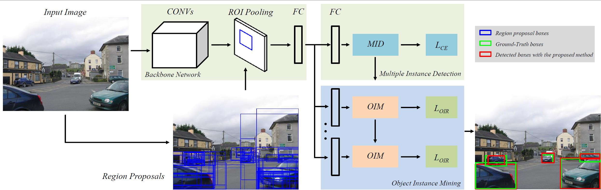
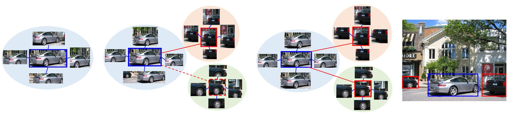
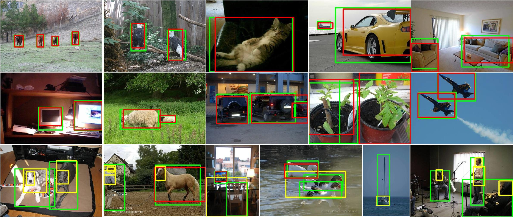

## Object Instance Mining for Weakly Supervised Object Detection

**[Chenhao Lin](mailto:linchenhao@sensetime.com), Siwen Wang, Dongqi Xu, [Yu Lu](mailto:luyu@sensetime.com), [Wayne Zhang](mailto:wayne.zhang@sensetime.com).**

SenseTime Research, SenseTime.

### Overview of OIM
**Object Instance Mining (OIM) for weakly** supervised object detection that effectively mines all possible instances with only image-level annotation using spatial and appearance graphs.  

The paper has been accepted by AAAI 2020. For more details, please refer to our [paper](https://arxiv.org/abs/XXXX).

<p align="left">

</p>

<p align="left">

</p>

## Getting started
#### Requirements
1. Requirements for `Caffe` and `pycaffe` (see: [Caffe installation instructions](http://caffe.berkeleyvision.org/installation.html))

  **Note:** Caffe *must* be built with support for Python layers!

  ```make
  # In your Makefile.config, make sure to have this line uncommented
  WITH_PYTHON_LAYER := 1
  ```
2. Python packages you might not have: `cython`, `python-opencv`, `easydict`
3. MATLAB

### Installation

1. Clone the OIM repository
  ```Shell
  # Make sure to clone with --recursive
  git clone --recursive https://github.com/XXXXX
  ```

2. Build the Cython modules
  ```Shell
  cd $OIM_ROOT/lib
  make
  ```

3. Build Caffe and pycaffe
  ```Shell
  cd $OIM_ROOT/caffe-oim
  # Following the Caffe installation instructions here:
  #   http://caffe.berkeleyvision.org/installation.html
  make all -j
  make pycaffe
  ```

### Train
1. Download VOCdevkit datasets

  ```Shell
  wget http://host.robots.ox.ac.uk/pascal/VOC/voc2007/VOCtrainval_06-Nov-2007.tar
  wget http://host.robots.ox.ac.uk/pascal/VOC/voc2007/VOCtest_06-Nov-2007.tar
  wget http://host.robots.ox.ac.uk/pascal/VOC/voc2012/VOCdevkit_18-May-2011.tar
  ```

2. Extract all of these tars into one directory named `VOCdevkit`

  ```Shell
  tar xvf VOCtrainval_06-Nov-2007.tar
  tar xvf VOCtest_06-Nov-2007.tar
  tar xvf VOCdevkit_18-May-2011.tar
  ```

3. Get pre-computed Selective Search object proposals and put into $OIM_ROOT/data/selective_search_data.   
  ```Shell
  cd $OIM_ROOT
  ./data/scripts/fetch_selective_search_data.sh
  ```

4. Download ImageNet pre-trained models available in the [Caffe Model Zoo](https://github.com/BVLC/caffe/wiki/Model-Zoo).

  ```Shell
  cd $OICR_ROOT
  ./data/scripts/fetch_imagenet_models.sh
  ```

5. Train on VOC 2007 trainval:

  ```Shell
  ./tools/train_oim.sh oim_train models/VGG16/solver.prototxt 0.2 0.2 5.0 data/imagenet_models/$VGG16_model_name
  ```
6. Test and evaluate on VOC 2007 trainval and test:

#### On trainval
  ```Shell
  ./tools/val_oim.sh oim_trainval models/VGG16/test.prototxt output/oim_train_st2/voc_2007_trainval/vgg16_oim_st2_iter_20000.caffemodel
  ```

#### On test
  ```Shell
  ./tools/test_oim.sh oim_test models/VGG16/test.prototxt output/oim_train_st2/voc_2007_trainval/vgg16_oim_st2_iter_20000.caffemodel
  ```

#### Evaluation
For mAP, run the python code tools/reval.py
  ```Shell
  ./tools/reval.py $output_dir --imdb voc_2007_test --matlab
  ```

For CorLoc, run the python code tools/reval_discovery.py
  ```Shell
  ./tools/reval_discovery.py $output_dir --imdb voc_2007_trainval
  ```

### Sample Rrsults

<p align="left">

</p>
Some OIM visualization results.

## Citation
```
@inproceedings{baek2019character,
  title={Object Instance Mining for Weakly Supervised Object Detection},
  author={Chenhao Lin, Siwen Wang, Dongqi Xu, Yu Lu, Wayne Zhang},
  booktitle={},
  pages={9365--9374},
  year={2020}
}
```

### License

```
Copyright (c) 2019-present SenseTime Research.

Permission is hereby granted, free of charge, to any person obtaining a copy
of this software and associated documentation files (the "Software"), to deal
in the Software without restriction, including without limitation the rights
to use, copy, modify, merge, publish, distribute, sublicense, and/or sell
copies of the Software, and to permit persons to whom the Software is
furnished to do so, subject to the following conditions:

The above copyright notice and this permission notice shall be included in
all copies or substantial portions of the Software.

THE SOFTWARE IS PROVIDED "AS IS", WITHOUT WARRANTY OF ANY KIND, EXPRESS OR
IMPLIED, INCLUDING BUT NOT LIMITED TO THE WARRANTIES OF MERCHANTABILITY,
FITNESS FOR A PARTICULAR PURPOSE AND NONINFRINGEMENT.  IN NO EVENT SHALL THE
AUTHORS OR COPYRIGHT HOLDERS BE LIABLE FOR ANY CLAIM, DAMAGES OR OTHER
LIABILITY, WHETHER IN AN ACTION OF CONTRACT, TORT OR OTHERWISE, ARISING FROM,
OUT OF OR IN CONNECTION WITH THE SOFTWARE OR THE USE OR OTHER DEALINGS IN
THE SOFTWARE.
```

### References
<ul>
    <li id="ref1"><a style="color:#337ab7;"   target="_blank" href="https://github.com/ppengtang/oicr">https://github.com/ppengtang/oicr</a></li>
  	<li id="ref2"><a style="color:#337ab7;"   target="_blank" href="https://github.com/rbgirshick/py-faster-rcnn">https://github.com/rbgirshick/py-faster-rcnn</a></li>
</ul>

